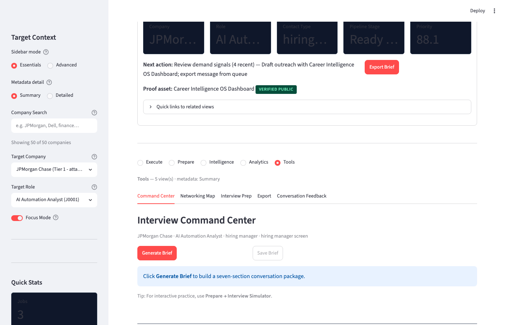
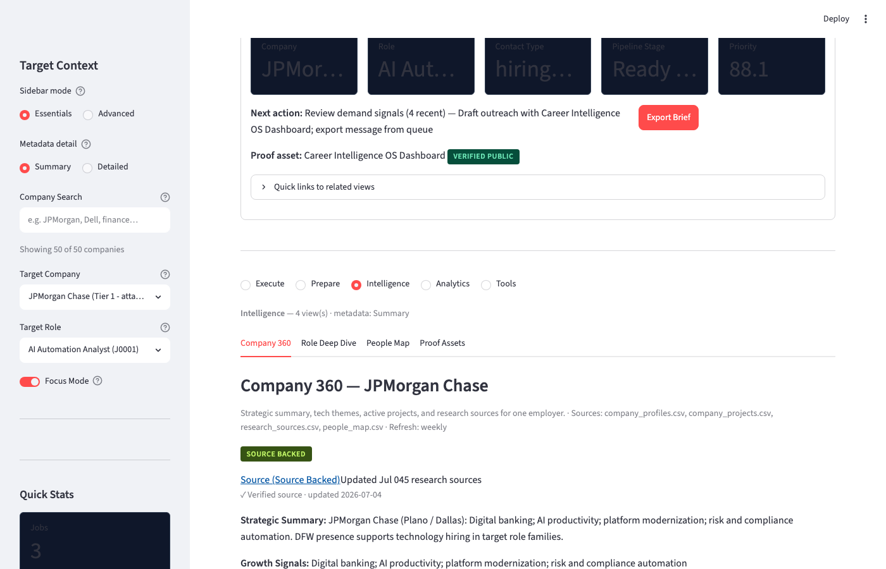
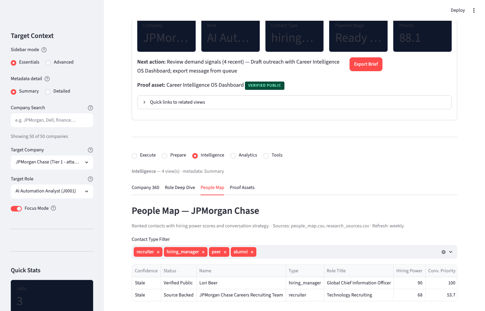
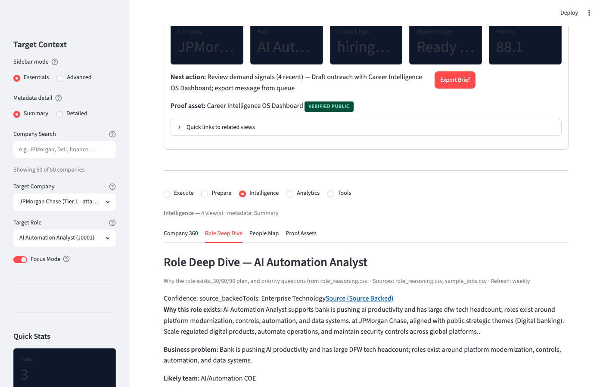
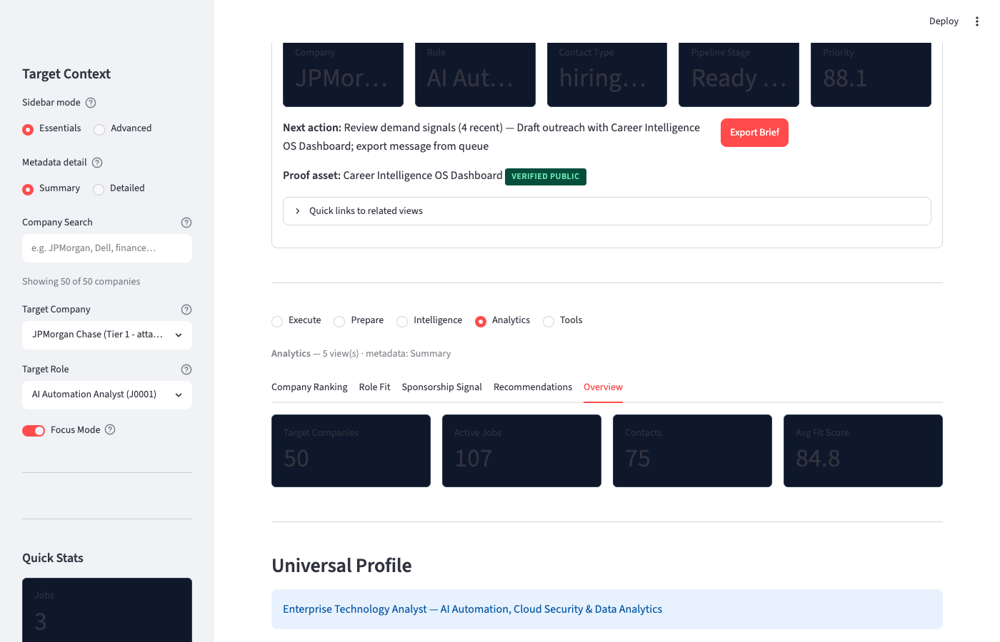
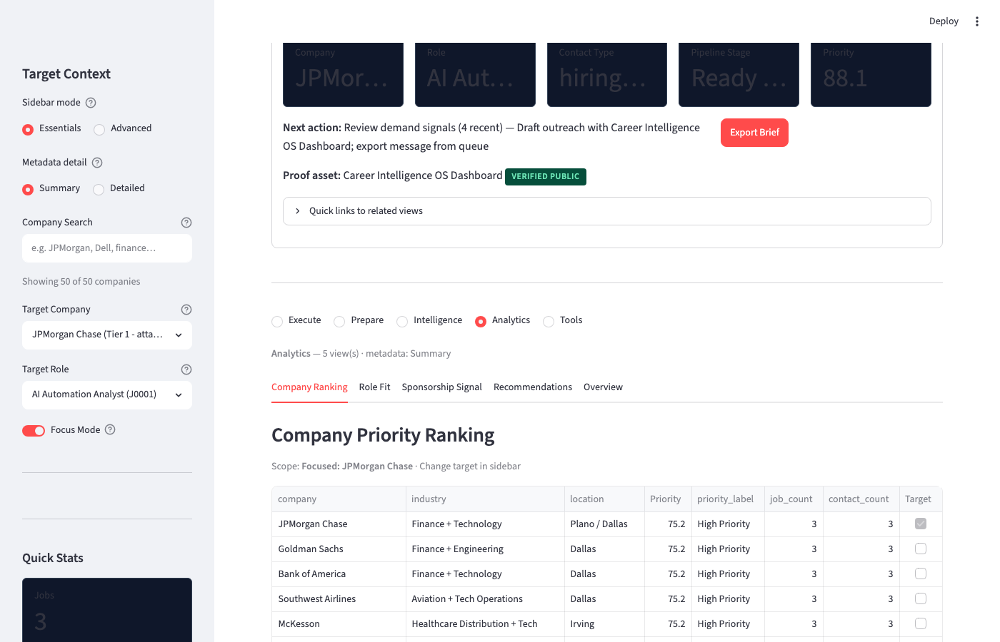
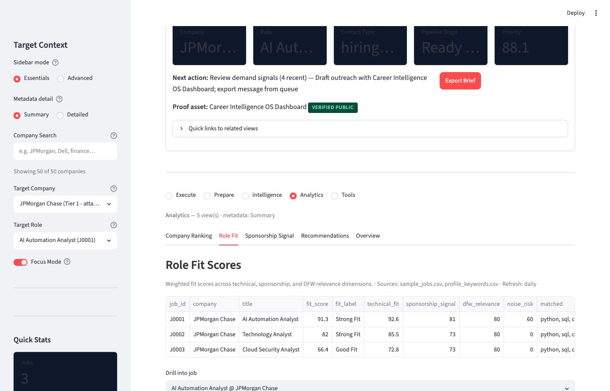
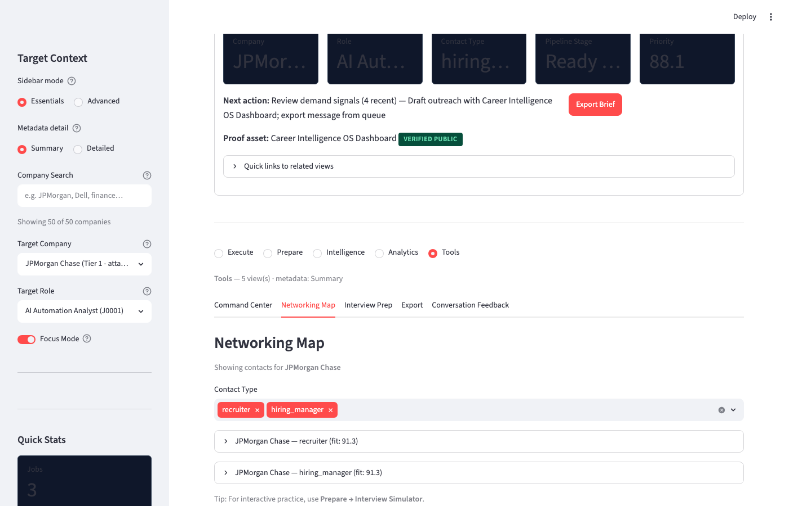
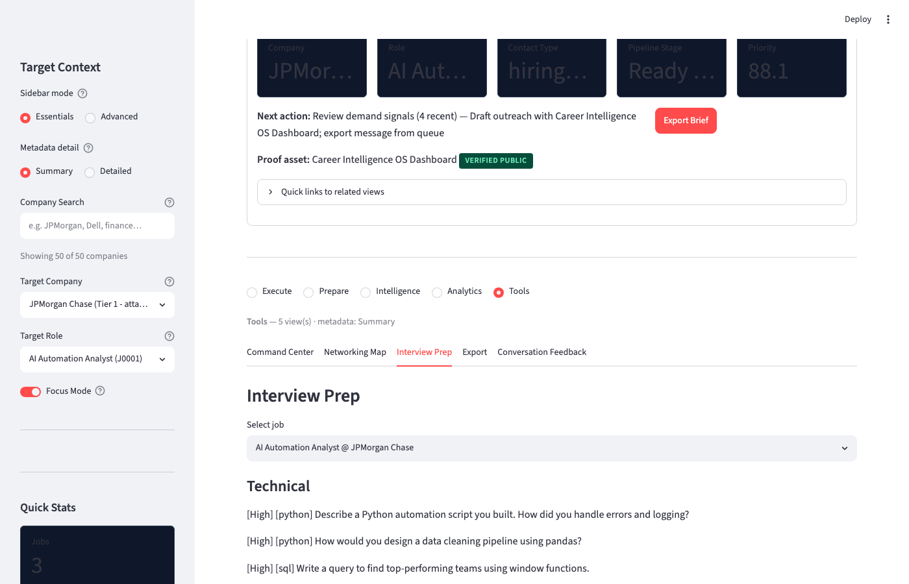
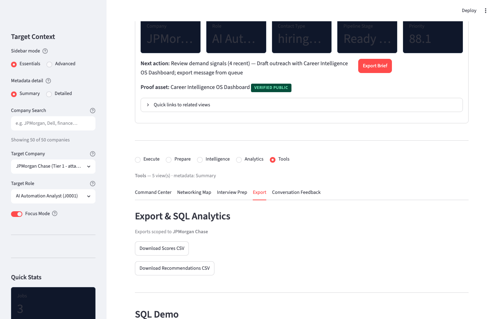

# Career Intelligence OS

**Sponsor-aware career intelligence system for enterprise technology roles.**

An AI-enabled enterprise decision system for role-fit scoring, talent intelligence, outreach strategy, sponsor-aware targeting, and interview readiness — built as a portfolio proof triangle: working demo, business case, and conversation weapon.

> **Universal Profile:** Enterprise Technology Analyst — AI Automation, Cloud Security & Data Analytics

## Business Problem

Enterprise technology hiring in DFW is fragmented across 50+ sponsor-friendly employers, hundreds of role families, and opaque sponsorship signals. Candidates and analysts lack a unified decision system to prioritize companies, score role fit, detect noise, and plan outreach — leading to wasted applications and missed warm-intro opportunities.

## Solution

Career Intelligence OS ingests structured company, job, and contact data; scores roles against a universal enterprise technology profile; surfaces sponsorship signals (with legal disclaimers); and generates actionable recommendations — apply now, network first, research more, or skip/watchlist.

## Features

| Capability | Module | What It Proves |
|------------|--------|----------------|
| Data ingestion & validation | `src/data_loader.py`, `src/schema_validator.py` | Data engineering, schema design |
| Role-fit scoring | `src/role_fit_scorer.py` | Weighted analytics, business logic |
| Company prioritization | `src/company_priority_scorer.py` | Enterprise targeting decisions |
| Sponsorship signals | `src/sponsorship_signal.py` | Risk-aware signal interpretation |
| Noise detection | `src/noise_detector.py` | Quality heuristics, ghost job flags |
| Recommendations | `src/recommendation_engine.py` | Decision automation |
| Outreach angles | `src/outreach_angle_generator.py` | Business communication |
| Interview prep | `src/interview_topic_mapper.py` | Domain knowledge mapping |
| Gap analysis | `src/profile_gap_analyzer.py` | Skills gap identification |
| Dashboard | `dashboard/app.py` | KPI storytelling, Streamlit |
| **Interview Command Center** | `src/company_profile_engine.py`, `src/conversation_brief_generator.py`, etc. | End-to-end interview prep with company 360, people map, role reasoning, proof matching |
| **Mission Control** | `src/mission_control_engine.py`, `src/pipeline_engine.py`, etc. | Monday-ready execution: action queue, pipeline board, message queue, readiness score |
| **Interview Simulator** | `src/interview_simulator.py` | AI recruiter practice from verified `interview_insights.csv` — works offline (rule-based) |
| **My Profile & Portfolio** | `src/profile_manager.py` | In-app profile, STAR stories, proof links — feeds Simulator automatically |
| **Verified Sources** | `src/data_confidence.py`, `data/interview_insights.csv` | Source freshness badges; no placeholder interview questions |

## v1.3 — Demand First Intelligence

Version **1.3.0** adds the **Demand First** operating model: company signals and role fit before people search.

| Capability | Module | Data File |
|------------|--------|-----------|
| Demand signals | `src/demand_intelligence_engine.py` | `company_demand_signals.csv` |
| Role demand scoring (100 pts) | `src/role_demand_scorer.py` | `role_demand_scores.csv` |
| Contact pods (15 slots) | `src/contact_pod_builder.py` | `contact_pods.csv` |
| Engagement hooks + drafts | `src/engagement_engine.py` | `engagement_hooks.csv`, `outreach_queue.csv` |
| Knowledge graph | `src/knowledge_graph.py` | `knowledge_graph_edges.csv` |
| Relationship XLSX export | `src/relationship_workbook.py` | `data/relationship_graph_export/` |

**Workflow:** Company → Recent Jobs → Role Fit → Team Signals → People Map → Engagement Hook → Message Draft → Manual Outreach → Feedback → Portfolio → Follow-up

**Execute tab:** **Demand First** (new) + Mission Control. Focus Mode prioritizes Tier A roles and surfaces demand blockers.

Seed: `python scripts/seed_demand_first_data.py` · Guide: [docs/demand-first-workflow.md](docs/demand-first-workflow.md)

## v1.2 — Grouped Navigation & Metadata-Rich UI

Version **1.2.0** reorganizes the dashboard from 17 flat tabs into **5 navigation groups** with 1–5 views visible at a time:

| Group | Views |
|-------|-------|
| **Execute** | Demand First, Mission Control |
| **Prepare** | Interview Simulator, My Profile & Portfolio |
| **Intelligence** | Company 360, Role Deep Dive, People Map, Proof Assets |
| **Analytics** | Company Ranking, Role Fit, Sponsorship Signal, Recommendations, Overview |
| **Tools** | Command Center, Networking Map, Interview Prep (legacy), Export, Conversation Feedback |

**Progressive disclosure:** Sidebar **Essentials / Advanced** mode hides person/stage filters and system status until needed. **Summary / Detailed** metadata toggle controls chip density across all panels.

**Metadata layer:** `src/metadata_renderer.py` surfaces fit scores, source URLs, freshness badges, and confidence bars on entity cards. Feature help text comes from `data/feature_registry.yaml`.

**Performance:** Lazy loaders in `src/data_loader.py` — `load_core()`, `load_intelligence(company_id)`, `load_mission_control_data()`. Only the active navigation group renders on each rerun.

## Mission Control

Mission Control is the **default tab** — it answers Monday morning questions in one view without clicking through 10 tabs.

| Question | Where |
|----------|-------|
| What do I do today? | Today's Action Queue + activity schedule |
| Who to contact? | Top 10 Targets + message queue |
| What proof to show? | Selected Target panel + proof asset on each card |
| What follow-up is due? | Follow-Up Radar |

| Module | Purpose |
|--------|---------|
| `src/pipeline_engine.py` | Build/score pipeline cards from jobs, people, proof, recommendations |
| `src/schedule_engine.py` | Monday launch plan + daily activity schedule |
| `src/mission_control_engine.py` | Readiness score (5×20 pts), warnings, orchestration |
| `src/message_queue_engine.py` | Copy-ready outreach drafts (no auto-send) |

**Data files:** `pipeline_cards.csv`, `monday_launch_plan.csv`, `activity_schedule.csv`

### Monday Launch Workflow

1. **Saturday/Sunday** — run `python scripts/seed_pipeline_cards.py`; enrich research_sources and verify contacts
2. **Monday 9:00 AM** — open **Mission Control** → check **Monday Readiness Score**
3. **9:30** — verify top contacts (People Map tab)
4. **10:30–11:30** — copy messages from Message Queue; log in `conversation_log_template.csv`
5. **End of day** — update pipeline stages; mark activities done in schedule

Real conversation **examples** live in `docs/examples/sample_conversation_log.csv` — the live template CSV (`data/conversation_log_template.csv`) is header-only for your real logs.

## Interview Command Center

The ICC upgrade transforms CI OS from a portfolio dashboard into an **end-to-end interview preparation system**:

| Capability | Module | Data File |
|------------|--------|-----------|
| Company 360 profiles | `src/company_profile_engine.py` | `data/company_profiles.csv` |
| People / power mapping | `src/people_power_mapper.py` | `data/people_map.csv` |
| Role reasoning (30/60/90) | `src/role_reasoning_engine.py` | `data/role_reasoning.csv` |
| Proof-of-work matching | `src/proof_asset_mapper.py` | `data/proof_assets.csv` |
| Conversation briefs | `src/conversation_brief_generator.py` | `data/conversation_briefs.csv` |
| Research prompts | `src/research_prompt_generator.py` | `prompts/*.md` |

**Seed companies:** All 50 DFW target employers in `data/companies.csv` — enriched from public sources (July 2026).

**Rules:** CSV-first, no TBD placeholders, no invented contact names. Use `source_backed` for official careers teams and `verified_public` only when name/role appears on a public company page. Manual verification workflow for individual contacts — see [docs/research-enrichment-workflow.md](docs/research-enrichment-workflow.md).

### ICC Demo Flow

1. Open dashboard → global selectors at top: company, role, conversation type, stage
2. **Interview Command Center** tab → click **Generate Brief**
3. Review 7 sections: Company 360, Role Intelligence, People Map, Proof Match, Script, Interview Prep, Action Plan
4. **Export Brief as Markdown** or **Save Brief** (appends to CSV + `exports/`)
5. Explore **Company 360**, **People Map**, **Role Deep Dive**, **Proof Assets** tabs
6. Use research prompt expanders to enrich CSVs manually (see [docs/research-enrichment-workflow.md](docs/research-enrichment-workflow.md))

**Acceptance test:** JPMorgan Chase + any role + hiring manager + hiring manager screen → full brief + markdown export.

## Interview Practice Simulator

Rule-based recruiter practice **without any API key**. Questions come only from `data/interview_insights.csv` (82 verified insights across 10 DFW companies).

| Step | Action |
|------|--------|
| 1 | Sidebar → JPMorgan Chase + target role |
| 2 | **Interview Simulator** tab → pick round |
| 3 | **Start New Question** → answer in chat → feedback + STAR suggestion |
| 4 | **Save Session** → `data/simulator_sessions.csv` |

Optional LLM: `OLLAMA_BASE_URL` / `OPENAI_API_KEY` in `.env` — [docs/interview-simulator-guide.md](docs/interview-simulator-guide.md)

Profile: **My Profile & Portfolio** tab or `data/user_profile.yaml` — [docs/PROFILE.md](docs/PROFILE.md)

### Quick Start: First Brief in 5 Minutes

```bash
git clone https://github.com/abhishekyadav2000/career-intelligence-os.git
cd career-intelligence-os
python3 -m venv .venv && source .venv/bin/activate
pip install -r requirements.txt
streamlit run dashboard/app.py
```

1. Open `http://localhost:8501` → set **Company** to JPMorgan Chase, pick any role
2. **Interview Command Center** tab → **Generate Brief** → review 7 sections
3. **Export Brief as Markdown** or open a pre-generated sample in [`exports/`](exports/) (e.g. [`brief-jpmorgan-chase-sample.md`](exports/brief-jpmorgan-chase-sample.md))
4. Follow the step-by-step playbook: [docs/first-conversation-playbook.md](docs/first-conversation-playbook.md)

**Pre-generated sample briefs:** [`exports/brief-jpmorgan-chase-sample.md`](exports/brief-jpmorgan-chase-sample.md) · [`exports/brief-citi-sample.md`](exports/brief-citi-sample.md) · [`exports/brief-capital-one-sample.md`](exports/brief-capital-one-sample.md) · [`exports/brief-toyota-sample.md`](exports/brief-toyota-sample.md) · [`exports/brief-att-sample.md`](exports/brief-att-sample.md)

## Demo Flow

1. **Mission Control** — company workspace when focused (intel, actions, message, interview prep)
2. **My Profile & Portfolio** — edit profile + copy 60-second pitch
3. **Interview Simulator** — verified-source recruiter practice (offline rule-based)
4. **Interview Command Center** — generate full conversation brief
3. **Overview** — KPIs, gap matrix, fit distribution
4. **Company Ranking** — priority scores across 50 DFW targets
5. **Role Fit** — six-category scoring with drill-down
6. **Sponsorship Signal** — H-1B/PERM indicators (signal only)
7. **Networking Map** — outreach angles by contact type
8. **Interview Prep** — technical, business, behavioral topics
9. **Recommendations** — apply / network / research / skip
10. **Export** — CSV download + SQL analytics demo
11. **Conversation Feedback** — outreach insights, warm companies, portfolio gaps

See [docs/demo-guide.md](docs/demo-guide.md) for 2-min and 5-min demo scripts.

## Dashboard Walkthrough

| # | Tab | Screenshot |
|---|-----|------------|
| 0 | Mission Control |  |
| 1 | Interview Command Center |  |
| 2 | Company 360 |  |
| 3 | People Map |  |
| 4 | Role Deep Dive |  |
| 5 | Proof Assets |  |
| 6 | Overview |  |
| 7 | Company Ranking |  |
| 8 | Role Fit |  |
| 9 | Sponsorship Signal |  |
| 10 | Networking Map |  |
| 11 | Interview Prep |  |
| 12 | Recommendations |  |
| 13 | Export & SQL |  |

To recapture screenshots: `python scripts/capture_screenshots.py` (requires Playwright + running dashboard).

## Architecture

```
data/ (CSVs) → data_loader → schema_validator → data_cleaner
                                    ↓
              scoring engine (role_fit, company_priority, sponsorship, noise)
                                    ↓
              recommendation_engine → outreach / interview / gap analyzers
                                    ↓
              dashboard/app.py (Streamlit) + SQLite audit trail
```

See [docs/architecture.md](docs/architecture.md) for full system design.

## Project Structure

```
career-intelligence-os/
├── src/                    # Python modules (scoring + ICC engines)
├── data/                   # Sample datasets + ICC CSVs + conversation log
├── dashboard/              # Streamlit app
├── docs/                   # Architecture, vision, demo guide, job search loop
├── case-studies/           # Portfolio case studies (3)
├── company-packets/        # Target company briefs (12 + template)
├── conversation-playbooks/ # Outreach scripts (6 playbooks)
├── exports/                # Pre-generated conversation brief samples
├── interview-packets/      # Role family prep (6 packets)
├── prompts/                # AI agent prompt templates
├── presentation/           # Demo scripts, LinkedIn copy, walkthrough
├── tests/                  # Scoring + ICC + conversation feedback tests
├── screenshots/            # Dashboard captures
├── scripts/                # Screenshot capture utility
├── README.md
├── requirements.txt
└── .env.example
```

## Employer Proof Points

- **Data pipeline:** CSV ingestion with schema validation and normalization
- **Decision engine:** Multi-dimensional scoring with explainable categories
- **Risk awareness:** Sponsorship signals flagged as indicative, not legal certainty
- **Business communication:** Rule-based outreach and interview prep generators
- **SQL analytics:** SQLite demo with joins, aggregations, CTEs
- **Portfolio narrative:** Case study, architecture docs, demo scripts

## Tests

```bash
python3 tests/test_scoring.py
# or
python3 -m pytest tests/
```

## Data

Sample data migrated from DFW Top-50 Sponsor-Friendly Company Workbook:
- 50 companies, ~117 jobs, ~75 contacts
- See [docs/data-dictionary.md](docs/data-dictionary.md)

## Case Studies

Portfolio narratives that complement this repository:

- [Career Intelligence OS](case-studies/career-intelligence-os.md)
- [AI Agent Risk Scoring](case-studies/ai-agent-risk-scoring.md)
- [Secure Cloud Evidence Lab](case-studies/secure-cloud-evidence-lab.md)

## License

MIT — portfolio demonstration project.
