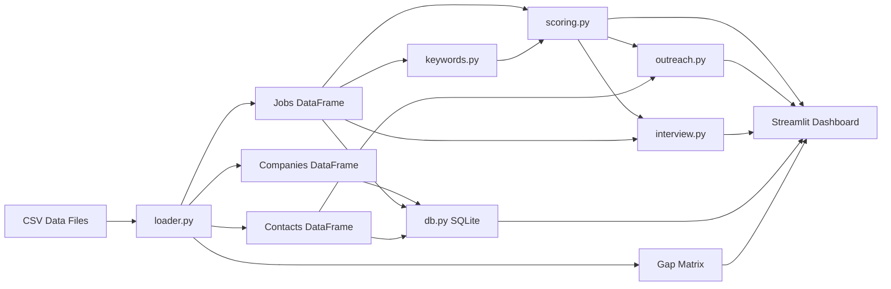

# Architecture

## System Overview

Career Intelligence OS is a modular Python pipeline that ingests DFW enterprise job data, analyzes role fit against a universal profile, and generates actionable outreach and interview prep — all surfaced through a Streamlit dashboard with SQLite analytics.

## Data Flow



## Module Responsibilities

### `src/loader.py`
- Loads `companies.csv`, `jobs.csv`, `contacts.csv`, `gap_matrix.csv`
- Returns pandas DataFrames for downstream processing
- Single entry point: `load_all()`

### `src/keywords.py`
- Tokenizes job descriptions
- Matches against skill taxonomy (8 capability buckets)
- Returns ranked keywords and category groupings
- No external NLP dependencies — uses regex + Counter

### `src/scoring.py`
- Weighted scoring against universal profile dimensions:
  - Python (15%), SQL (12%), Cloud (12%), Security (15%)
  - Data Analytics (12%), AI Automation (15%)
  - Risk/GRC (10%), Business Analysis (9%)
- Produces fit score (0–100), label, dimension breakdown, gaps

### `src/outreach.py`
- Template-based message generation per contact type:
  - `recruiter` — skill alignment + OPT transparency
  - `hiring_manager` — business problem framing
  - `peer` — day-to-day insight request
  - `alumni` — UNT connection + culture navigation
- Includes follow-up template

### `src/interview.py`
- Maps matched skill categories to interview question bank
- Generates business-context questions from `business_problem` field
- Includes behavioral STAR prompts

### `src/db.py`
- Initializes SQLite from CSV data
- Provides 5 demo SQL queries (joins, aggregations, filtering)
- Supports ad-hoc query execution

### `app/dashboard.py`
- Streamlit UI with 6 tabs
- Cached pipeline execution via `@st.cache_data`
- Sidebar filters for tier and company
- Interactive drill-down for scores, keywords, outreach, interview prep

## Skill Taxonomy Design

The keyword taxonomy mirrors the DFW workbook's recurring keywords across all 50 companies:

| Category | Sample Keywords |
|----------|----------------|
| python | python, pandas, etl, scripting, automation |
| sql | sql, database, joins, cte, window function |
| cloud | aws, azure, gcp, kubernetes, docker, terraform |
| security | iam, siem, splunk, zero trust, incident response |
| data_analytics | data pipeline, dashboard, kpi, metrics |
| ai_automation | ai, automation, ml, llm, rag, workflow |
| risk_grc | risk, controls, grc, compliance, audit, nist |
| business_analysis | requirements, agile, jira, stakeholder |

## Scoring Algorithm

```
fit_score = sum(dimension_score * weight)

dimension_score = min(matched_phrases / (total_phrases * 0.3), 1.0) * 100
```

Labels:
- **Strong Fit** >= 75
- **Good Fit** >= 55
- **Moderate Fit** >= 35
- **Stretch Role** < 35

## Security Considerations

- No API keys or external services required
- SQLite database is local-only, auto-generated from CSV
- No PII stored — sample contact names are placeholders
- `.gitignore` excludes database files and secrets

## Extension Points

| Future Enhancement | Module | Effort |
|-------------------|--------|--------|
| RAG over resume + JDs | New `rag.py` | Medium |
| Live job scraping | New `scraper.py` | High |
| AI risk scoring rubric | New `ai_risk.py` | Medium |
| Power BI export | `db.py` + export | Low |
| GitHub Actions CI | `.github/workflows/` | Low |

## Dependencies

- **Python 3.10+**
- **pandas** — DataFrame operations
- **streamlit** — Dashboard UI
- **sqlite3** — Standard library, no install needed
