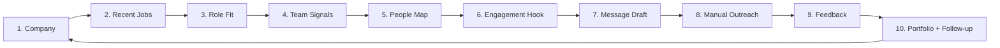

# Recursive Job Search Loop

Career Intelligence OS implements a **10-step Demand First loop** (v1.3) that turns job search from reactive applications into a measurable operating system. **Before people, find demand. Before outreach, find context.**

See [demand-first-workflow.md](demand-first-workflow.md) for the full v1.3 operating model.

---

## The Loop (Demand First v1.3)



---

## 10 Steps

| Step | Action | Tool / Artifact | Output |
|------|--------|----------------|--------|
| **1. Company** | Select Tier-1 target | Company Ranking, Focus Mode | Priority company |
| **2. Recent Jobs** | Review demand signals | Demand First tab, `company_demand_signals.csv` | Source-backed hiring signals |
| **3. Role Fit** | Score with 100-pt formula | `role_demand_scores.csv` | Tier A/B/C/D board |
| **4. Team Signals** | Business units hiring | Demand signals by technology area | Hiring themes |
| **5. People Map** | 15-slot contact pod | `contact_pods.csv` | Search URLs — no fake names |
| **6. Engagement Hook** | Signal → opener | `engagement_hooks.csv` | Level 1–10 ladder |
| **7. Message Draft** | Value-first copy | `outreach_queue.csv` | Human-reviewed drafts |
| **8. Manual Outreach** | Send + log | Conversation playbooks | Logged outreach |
| **9. Feedback** | Analyze patterns | Conversation Feedback tab | Gaps, warm companies |
| **10. Follow-up** | Portfolio improvement | Proof assets, pipeline | Stronger next cycle |

---

## Daily Workflow

### Morning (30 min) — Analyze + Plan
1. Open dashboard → check Conversation Feedback tab for pending actions
2. Review Company Ranking → pick 1–2 targets for today
3. Open company packet → prepare talking points
4. Check Role Fit tab for top roles at target company

### Midday (30 min) — Outreach
5. Send 1–2 outreach messages using conversation playbooks
6. Log each outreach in conversation log CSV immediately
7. Apply follow-up timing from follow-up-messages playbook

### Evening (20 min) — Reflect + Update
8. Log any responses or conversations from the day
9. Check Conversation Feedback tab for new patterns
10. If portfolio gap identified → note it for next build session
11. Set follow-up dates in conversation log

### Weekly (1 hour) — Portfolio Iteration
12. Review all conversation log entries for the week
13. Identify top 3 repeated objections and top 3 skill gaps
14. Update one portfolio artifact to address the highest-priority gap
15. Refresh company packets if new public information available

---

## Loop Velocity Targets

| Metric | Target | How to Measure |
|--------|--------|---------------|
| Outreach per week | 5–8 targeted | Conversation log entries |
| Response rate | >20% | Warm companies / total outreach |
| Conversations per week | 2–3 | person_type logged |
| Portfolio updates per month | 2–3 | Git commits addressing gaps |
| Loop cycle time | 1–2 weeks | Target → outreach → conversation → update |

---

## Feedback Signals

The Conversation Feedback tab surfaces these automatically:

| Signal | Meaning | Action |
|--------|---------|--------|
| **Warm company** | Positive response logged | Prioritize follow-up and deeper prep |
| **Cold company** | Declined or no response | Reduce effort; try alternate contact type |
| **Repeated objection** | Same theme across conversations | Address in portfolio or disclosure approach |
| **Skill gap** | Interviewer asked for evidence you lack | Build artifact (lab module, case study depth) |
| **Next action** | Pending follow-up with date | Execute on follow-up date |

---

## Example Loop Cycle

```
Week 1: Target JPMorgan Chase
  → Analyze Technology Analyst role (fit: 82/100)
  → Talking points: platform modernization, AI automation controls
  → Outreach to recruiter (LinkedIn)
  → Response: "Interested — send portfolio link"
  → Log conversation, send demo link
  → Feedback: warm company, no objections yet

Week 2: Target Citi (parallel)
  → Analyze Cloud Security Analyst role (fit: 78/100)
  → Outreach to hiring manager (referral)
  → Conversation: "Show IAM evidence, not just keywords"
  → Log gap: "Cloud / IAM / SIEM lab artifact"
  → Update: Secure Cloud Evidence Lab case study
  → Feedback: skill gap identified, portfolio improvement logged

Week 3: Follow up JPMorgan
  → Stronger outreach: include IAM walkthrough from updated lab
  → Reference prior conversation insight
  → Feedback loop complete — next outreach is stronger
```

---

## Integration Points

| Loop Step | CI OS Component |
|-----------|----------------|
| Target + Analyze | Dashboard tabs (Ranking, Role Fit, Sponsorship) |
| Talking Points | Company packets + interview packets |
| Outreach | Conversation playbooks + Networking Map |
| Log + Analyze | conversation_log_template.csv + Conversation Feedback tab |
| Update Repo | Case studies, lab modules, gap matrix |

See [how-i-use-this-system.md](how-i-use-this-system.md) for personal workflow documentation.
