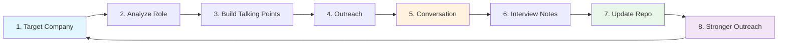

# Recursive Job Search Loop

Career Intelligence OS implements a **10-step recursive loop** that turns job search from reactive applications into a measurable operating system. Each cycle makes the next outreach stronger.

---

## The Loop



---

## 10 Steps

| Step | Action | Tool / Artifact | Output |
|------|--------|----------------|--------|
| **1. Target Company** | Select from ranked list | Company Ranking tab, company packets | Priority target with rationale |
| **2. Analyze Role** | Score fit, check sponsorship | Role Fit tab, Sponsorship Signal tab | Fit score + six-category breakdown |
| **3. Build Talking Points** | Prepare company-specific angles | Company packet, interview packet | 3 talking points tied to portfolio |
| **4. Outreach** | Send targeted message | Conversation playbooks, Networking Map tab | Logged outreach with contact type |
| **5. Conversation** | Recruiter call, informational, interview | Playbooks (recruiter, HM, peer, alumni) | Insights, objections, authorization clarity |
| **6. Interview Notes** | Capture questions, gaps, feedback | Interview packet for role family | Structured notes in conversation log |
| **7. Update Repo** | Fix portfolio gaps identified | Case studies, lab modules, dashboard | Improved artifact for next conversation |
| **8. Log Conversation** | Record in CSV | `data/conversation_log_template.csv` | Structured row with all fields |
| **9. Analyze Feedback** | Review patterns | Conversation Feedback tab | Warm companies, objections, next actions |
| **10. Stronger Next Outreach** | Apply learnings to next target | Company packets + updated portfolio | Higher-quality message with proof |

---

## Daily Workflow

### Morning (30 min) — Analyze + Plan
1. Open dashboard → check Conversation Feedback tab for pending actions
2. Review Company Ranking → pick 1–2 targets for today
3. Open company packet → prepare talking points
4. Check Role Fit tab for top roles at target company

### Midday (30 min) — Outreach
5. Send 1–2 outreach messages using conversation playbooks
6. Log each outreach in conversation log CSV immediately
7. Apply follow-up timing from follow-up-messages playbook

### Evening (20 min) — Reflect + Update
8. Log any responses or conversations from the day
9. Check Conversation Feedback tab for new patterns
10. If portfolio gap identified → note it for next build session
11. Set follow-up dates in conversation log

### Weekly (1 hour) — Portfolio Iteration
12. Review all conversation log entries for the week
13. Identify top 3 repeated objections and top 3 skill gaps
14. Update one portfolio artifact to address the highest-priority gap
15. Refresh company packets if new public information available

---

## Loop Velocity Targets

| Metric | Target | How to Measure |
|--------|--------|---------------|
| Outreach per week | 5–8 targeted | Conversation log entries |
| Response rate | >20% | Warm companies / total outreach |
| Conversations per week | 2–3 | person_type logged |
| Portfolio updates per month | 2–3 | Git commits addressing gaps |
| Loop cycle time | 1–2 weeks | Target → outreach → conversation → update |

---

## Feedback Signals

The Conversation Feedback tab surfaces these automatically:

| Signal | Meaning | Action |
|--------|---------|--------|
| **Warm company** | Positive response logged | Prioritize follow-up and deeper prep |
| **Cold company** | Declined or no response | Reduce effort; try alternate contact type |
| **Repeated objection** | Same theme across conversations | Address in portfolio or disclosure approach |
| **Skill gap** | Interviewer asked for evidence you lack | Build artifact (lab module, case study depth) |
| **Next action** | Pending follow-up with date | Execute on follow-up date |

---

## Example Loop Cycle

```
Week 1: Target JPMorgan Chase
  → Analyze Technology Analyst role (fit: 82/100)
  → Talking points: platform modernization, AI automation controls
  → Outreach to recruiter (LinkedIn)
  → Response: "Interested — send portfolio link"
  → Log conversation, send demo link
  → Feedback: warm company, no objections yet

Week 2: Target Citi (parallel)
  → Analyze Cloud Security Analyst role (fit: 78/100)
  → Outreach to hiring manager (referral)
  → Conversation: "Show IAM evidence, not just keywords"
  → Log gap: "Cloud / IAM / SIEM lab artifact"
  → Update: Secure Cloud Evidence Lab case study
  → Feedback: skill gap identified, portfolio improvement logged

Week 3: Follow up JPMorgan
  → Stronger outreach: include IAM walkthrough from updated lab
  → Reference prior conversation insight
  → Feedback loop complete — next outreach is stronger
```

---

## Integration Points

| Loop Step | CI OS Component |
|-----------|----------------|
| Target + Analyze | Dashboard tabs (Ranking, Role Fit, Sponsorship) |
| Talking Points | Company packets + interview packets |
| Outreach | Conversation playbooks + Networking Map |
| Log + Analyze | conversation_log_template.csv + Conversation Feedback tab |
| Update Repo | Case studies, lab modules, gap matrix |

See [how-i-use-this-system.md](how-i-use-this-system.md) for personal workflow documentation.
